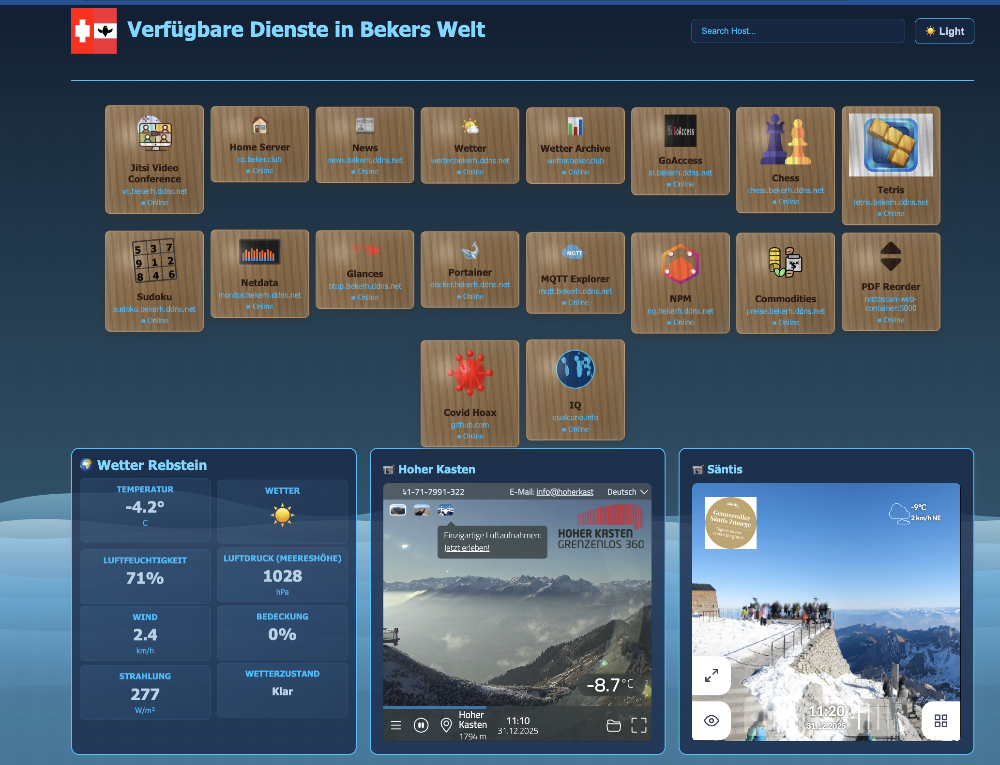

# Bekers Welt Dashboard

Ein modernes, responsives Web-Dashboard zur zentralen Verwaltung und Übersicht von verschiedenen Webdiensten mit Echtzeitwetterdaten, organisiert in übersichtlichen Kategorien.



## Was macht die App?

Das Dashboard bietet eine zentrale Übersicht über folgende Funktionen:

- **Kategorisierte Service-Übersicht**: Links zu Webdiensten, organisiert in 6 thematischen Rahmen
- **Wetterdaten**: Echtzeitinformationen zum Wetter in Rebstein (Temperatur, Luftfeuchtigkeit, Luftdruck, Windgeschwindigkeit, Bewölkung)
- **Webcam-Integration**: Live-Streams von der Säntis 360° Panorama Webcam und Hoher Kasten Webcam
- **Suchfunktion**: Schnelle Filterung der verfügbaren Dienste
- **Dark Mode**: Umschalter zwischen hellem und dunklem Design-Theme
- **Responsive Design**: Funktioniert auf Desktop, Tablet und Mobile-Geräten
- **Anime-Wellen-Animation**: Photorealistisch animierte Hintergrundelemente mit natürlichem Wasserwellen-Effekt
- **Cloud-Clip-Pfade**: Jede Service-Karte hat eine einzigartige Wolken-Form

## Service-Kategorien

Das Dashboard organisiert alle Services in 6 Rahmen, die responsiv nebeneinander angeordnet sind:

### 🏠 EnergieVerbrauch
- **Jitsi Video Conference**: Video-Konferenz-Lösung
- **Shell Cloud Control**: Shelly Smart Home Steuerung
- **MQTT Explorer**: MQTT Broker und Message Management
- **Home Server**: Zentrale Home-Automation und Server-Management
- **EnergieVerbrauch**: Historische Wetterdaten und Statistiken

### 📰 Nachrichten
- **News**: Nachrichten-Aggregator
- **Wetter**: Wettervorhersage und aktuelle Wetterdaten
- **Krone**: Österreichische Nachrichtenplattform

### 🎮 Spiele
- **Chess**: Schachspiel mit Online-Multiplayer
- **Tetris**: Klassisches Tetris-Game
- **Sudoku**: Sudoku-Rätsel mit Hover-Rotations-Animation

### 🔬 Wissenschaft
- **Newton**: Newton-Fraktal Explorer (AI Studio App)
- **Mandelbrot Explorer**: Mandelbrot-Set Visualization (AI Studio App)
- **Covid Hoax**: Statistische Analyse mit GitHub-Integration
- **GitHub Helmut**: GitHub-Profil und Repositories
- **World IQ**: Internationale Intelligenzstatistiken

### ⚙️ Server-Verwaltung
- **GoAccess**: Website-Traffic Analytics und Log-Analyse
- **Netdata**: Detaillierte System-Metriken und Monitoring
- **Glances**: System-Monitoring und Ressourcen-Überwachung
- **Portainer**: Docker Container Management
- **NPM**: Nginx Proxy Manager für Reverse Proxy und SSL-Management

### 🛠️ Werkzeuge
- **Commodities**: Rohstoffpreise und Marktdaten
- **PDF Reorder**: PDF-Seiten-Reordering und -Verarbeitung

## Wie funktioniert die App?

### Frontend-Architektur

Die App ist eine **Single Page Application (SPA)** mit folgender Struktur:

1. **HTML-Struktur**: Semantisches HTML5 mit CSS Grid Layout für die Service-Karten
2. **Styling**: CSS mit CSS-Variablen für Theme-Management, Gradient-Backgrounds, Wave-Animationen
3. **JavaScript**: Vanilla JavaScript für:
   - Theme-Verwaltung (Light/Dark Mode mit LocalStorage-Persistierung)
   - Suchfunktion mit Live-Filter über alle Services
   - Wetterdaten-Abrufen und -Anzeige
   - Card-Animationen mit gestaffelten Verzögerungen

### Layout-System

```
┌────────────────────────────────────────────────────┐
│         Bekers Welt Dashboard                      │
├────────────────────────────────────────────────────┤
│ Main Grid (10 Cards): Alle Service-Karten         │
├────────────────────────────────────────────────────┤
│ Frames Container (4 Spalten, responsive):          │
│ ┌──────────────┬──────────────┬──────────────┬──────┐
│ │ 🏠 Energie-  │ 📰 Nach-      │ 🎮 Spiele    │ 🔬   │
│ │   Verbrauch  │ richten       │              │ Wiss. │
│ ├──────────────┼──────────────┼──────────────┼──────┤
│ │ ⚙️ Server-   │ 🛠️ Werk-      │              │      │
│ │ Verwaltung   │ zeuge         │              │      │
│ └──────────────┴──────────────┴──────────────┴──────┘
├────────────────────────────────────────────────────┤
│ Weather & Webcam Section                           │
│ ┌──────────────┬──────────────┬──────────────┐    │
│ │ Weather      │ Hoher Kasten │ Säntis 360°  │    │
│ │ Rebstein     │ Webcam       │ Webcam       │    │
│ └──────────────┴──────────────┴──────────────┘    │
└────────────────────────────────────────────────────┘
```

### Datenfluss

```
┌─────────────────────────────────────────────────────┐
│           Browser / Client-Seite                    │
├─────────────────────────────────────────────────────┤
│                                                     │
│  ├─ Theme Toggle (LocalStorage)                    │
│  ├─ Search Input (DOM Filter)                      │
│  ├─ Fetch Weather API                              │
│  │   └─ Open-Meteo API → JSON → DOM Update        │
│  └─ Card Animations (CSS + JS)                    │
│                                                     │
└─────────────────────────────────────────────────────┘
```

### Animations-System

- **Card Float**: Karten schweben sanft mit wellenförmigen Bewegungen
- **Wave Background**: Animierte SVG-Wellen-Grafiken im Hintergrund (3 Ebenen)
- **Hover-Effekte**: Sanfte Übergänge und Erhöhungseffekt beim Hovern
- **Cloud Clip-Paths**: Jede Karte hat eine SVG-Wolken-Form für visuellen Appeal

## Frameworks und APIs

### Frontend-Frameworks

| Framework | Version | Zweck |
|-----------|---------|-------|
| **jQuery** | 1.7.1 | Geladen aber minimal genutzt (hauptsächlich Vanilla JS) |
| **Font Awesome** | 6.4.0 | Icon-Bibliothek für Symbole |

### Externe APIs

| API | Zweck | Quelle |
|-----|-------|--------|
| **Open-Meteo** | Wetterdaten (kostenlos, Open-Source) | `https://api.open-meteo.com/v1/forecast` |
| **Säntis Roundshot** | 360° Panorama-Webcam Säntis | `https://saentis.roundshot.com/` |
| **Feratel WebTV** | Hoher Kasten Webcam | `https://webtvfc.feratel.com/webtv/` |

### Wetter-API Details

Die App nutzt die **Open-Meteo API** mit folgenden Parametern für Rebstein (47.4167°N, 9.3167°O):

```
GET /v1/forecast?
  latitude=47.4167
  &longitude=9.3167
  &current=temperature_2m,relative_humidity_2m,weather_code,wind_speed_10m,cloud_cover
  &timezone=auto
```

**WMO Weather Codes Mapping**: Die App konvertiert WMO-Wettercodes in deutsche Beschreibungen und Emoji-Icons (z.B. 0 = Klar ☀️, 3 = Bedeckt ☁️, 65 = Starker Regen ⛈️)

## Technische Eigenschaften

### CSS-Features

- **CSS Grid & Flexbox**: Responsives Layout mit Frames Container
- **CSS-Variablen**: Zentrale Theme-Verwaltung (Light/Dark Mode)
- **CSS Gradients**: Farbtransitionen und Background-Effekte
- **CSS Animations**: Keyframe-Animationen für Wave und Card-Bewegungen
- **SVG-Grafiken**: Inline SVG für Service-Icons und Cloud Clip-Paths

### Browser-APIs

- **Fetch API**: Asynchrone Daten-Abrufe
- **LocalStorage**: Persistierung von Theme-Präferenz
- **DOM Manipulation**: Dynamische Content-Updates
- **CSS Variables (Custom Properties)**: Style-Injection per JavaScript

### Responsive Breakpoints

- **Mobile** (≤768px): Angepasste Kartengrößen, gestapeltes Frame-Layout
- **Desktop** (>768px): 4-spaltige Grid-Layout für Rahmen

## Performance

- **Wetter-Caching**: API wird alle 10 Minuten aufgerufen (throttling)
- **Graceful Degradation**: Fallback auf einfachere API-Parameter bei Fehlern
- **Lightweight**: Minimale externe Dependencies, hauptsächlich Vanilla JavaScript

## Installation & Deployment

Die App läuft als statische HTML-Datei und kann einfach auf einem Webserver bereitgestellt werden:

```bash
# Datei: /root/docker-stacks/apache/html/index.html
# Wird über Apache/Nginx auf http://localhost oder gehosteter Domain serviert
```

### Setup-Anleitung

#### Anforderungen

- Apache oder Nginx Webserver
- Moderner Browser mit ES6+ JavaScript-Unterstützung
- Internetverbindung für externe APIs (Open-Meteo, Feratel, Roundshot)
- Optional: Docker (für Container-Deployment)

#### Schritt 1: Datei-Platzierung

```bash
# Kopiere index.html in das Webserver-Verzeichnis
cp /root/docker-stacks/apache/html/index.html /var/www/html/
```

#### Schritt 2: Webserver-Konfiguration (Apache)

```bash
# Stelle sicher, dass Apache HTML-Dateien serve kann
# Standardmäßig sollte das bereits der Fall sein

# Bei Bedarf: .htaccess für Caching (optional)
<IfModule mod_expires.c>
    ExpiresActive On
    ExpiresByType text/html "access plus 1 hour"
    ExpiresByType text/css "access plus 1 year"
    ExpiresByType text/javascript "access plus 1 year"
    ExpiresByType image/svg+xml "access plus 1 year"
</IfModule>
```

#### Schritt 3: Webserver starten

```bash
# Apache starten
sudo systemctl start apache2

# Oder Docker-Container starten
docker-compose up -d
```

#### Schritt 4: Zugriff

Öffne deinen Browser und navigiere zu:
- Lokal: `http://localhost`
- Remote: `http://bekerh.ddns.net` oder konfigurierte Domain

### Konfiguration

Die App funktioniert mit Standardeinstellungen out-of-the-box. Falls Anpassungen nötig sind:

**Wetter-Lokation ändern** (in index.html):
```javascript
// Zeile ~1263-1264
const rebsteinLat = 47.4167;  // Breitengrad
const rebsteinLon = 9.3167;   // Längengrad
```

**Theme-Farben anpassen**:
Bearbeite die CSS-Variablen im `<style>`-Tag (Zeilen ~15-61):
```css
:root {
    --bg-gradient-1: #f0f8fc;  /* Beispiel: Hintergrundfarbe */
    --header-color: #006699;   /* Kopfzeilen-Farbe */
    --accent-color: #0099cc;   /* Akzentfarbe */
}
```

**Services hinzufügen/entfernen**:
Bearbeite die Service-Links im `<div class="grid">` Bereich oder in den entsprechenden Rahmen-Divs der index.html

### Performance-Optimierung

- **Wetter-Aktualisierungsintervall**: 600000ms (10 Minuten) - anpassbar in Zeile ~1467
- **Browser-Caching**: Nutze .htaccess oder Webserver-Header
- **CDN**: Externe Resources (Font Awesome) werden vom CDN geladen

### Troubleshooting

**Wetterdaten werden nicht angezeigt:**
- Überprüfe Browser-Konsole (F12) auf Fehler
- Stelle sicher, dass die Open-Meteo API erreichbar ist
- Prüfe ob CORS-Fehler vorliegen

**Webcams zeigen schwarzen Bildschirm:**
- Überprüfe Internetverbindung
- Stelle sicher, dass Feratel und Roundshot erreichbar sind
- Probiere Browser zu aktualisieren (Strg+F5)

**Dunkles Theme wird nicht gespeichert:**
- Überprüfe ob LocalStorage im Browser aktiviert ist
- Für Private-Browsing Mode: Theme wird nur in der Sitzung gespeichert

**Service-Links funktionieren nicht:**
- Stelle sicher, dass die entsprechenden Services im Netzwerk erreichbar sind
- Überprüfe Firewall-Regeln und Port-Freigaben
- Verifiziere die Domain-Namen in der index.html

## Zukünftige Erweiterungen

- Dynamische Service-Katalog-Verwaltung (JSON-Config)
- Status-Monitoring für Service-Verfügbarkeit
- Lokalisierung für weitere Sprachen
- Progressive Web App (PWA) Funktionalität
- Service-Health-Indikatoren in Echtzeit
- Benutzerdefinierte Frame-Anordnung (Drag & Drop)
